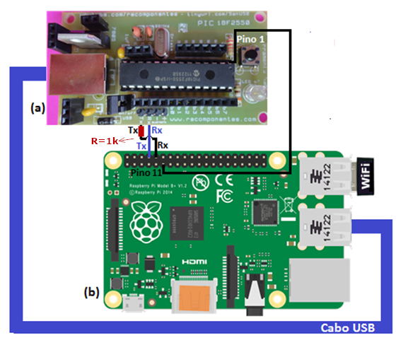
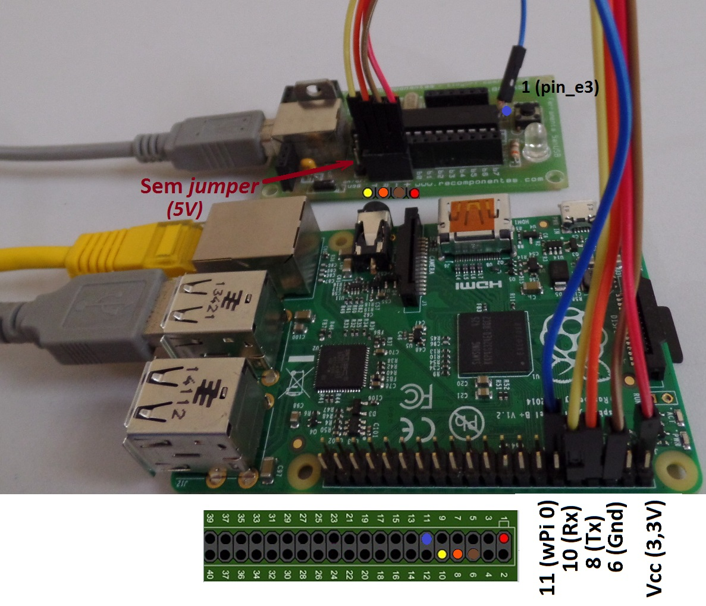

# Instalador do Gravador SANUSB para Raspberry Pi

## Pré requisitos

 * [OpenJDK Java](http://openjdk.java.net/install/) 6.

## Instalar

### Interface gráfica

Instale o **SanUSB Gravador - RPi** baixando o arquivo compactado http://sanusb.org/tools/SanUSBrpi.zip. Você poderá instalar pelo terminal:

```bash
# Entrar no modo de administrador
sudo su
# Baixar o gravador
wget http://sanusb.org/tools/SanUSBrpi.zip
# Descompactar
unzip SanUSBrpi.zip
# Ir para pasta descompactada
cd SanUSBrpi
# Instalar o .deb
sudo dpkg -i ./sanusb_raspberry.deb
# Atribuir permissão de execução
chmod +x sanusb
# Permitir que haja a execução do sanusb em qualquer diretório
cp sanusb /usr/share/sanusb
```

## Executar

Abra a interface gráfica após a instalação digitando **sanusb** no terminal.

```bash
sanusb
```

## Gravar SanUSB com Raspberry Pi

Conecte o SanUSB com o Raspberry Pi conforme as imagens





## Testar

Grave o exemplo pisca led pelo comando:

```bash
# Estando na pasta, execute
sanusb -w exemplo1.hex -r
```

Outros códigos de exemplo podem ser encontrados nos repositórios do [Grupo SanUSB no Github](https://github.com/SanUSB-grupo)

## Executar no terminal - Comandos

A lista de comandos pode ser obtida executando "sanusb -h"

```
Option     Description                                      Default
-------------------------------------------------------------------------
-w <file>  Write hex file to device (will erase first)      None
-e         Erase device code space (implicit if -w)         No erase
-r         Reset device on program exit                     No reset
-h         Help
```
